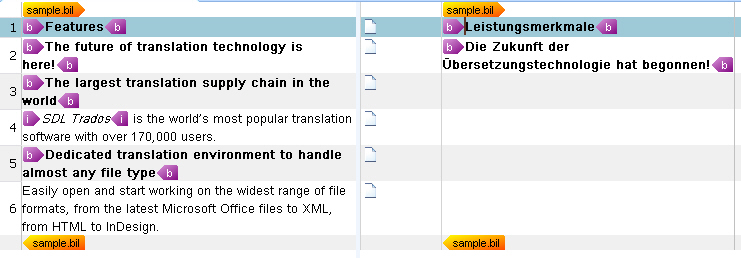

Applying Character Formatting
===

In this chapter you will learn how to enrich the editor display in <Var:ProdudctName> with character display formatting.

Apply Character Formatting
--

From the inline tags that our sample format is using it is easy to decide which type of character formatting to apply. Display formatting in an intermediary (SDL XLIFF) document is strictly speaking not necessary and has no impact on the actual BIL target file. It can be optionally applied for convenience reasons, at it usually helps translators to see the actual character formatting. It is also possible to hide inline tags, and just show the display formatting that they define. That way translators can apply the formatting to the corresponding strings in the target segments instead of transferring tags.

First, you need to add the following namespace to your parser class: using ```Sdl.FileTypeSupport.Framework.Formatting```.

Then you enhance your `CreateTagPair()` helper function, so that it not only generates tag pairs, but that is also applies the appropriate formatting at the same time. Through a ``switch`` statement you can then select the appropriate formatting based on the name of the element node:

# [C#](#tab/tabid-1)
```cs
// apply character formatting to the start tag
IFormattingGroup formattingGroup = PropertiesFactory.FormattingItemFactory.CreateFormatting();
startTag.Formatting = new FormattingGroup();
switch (item.Name)
{
    case "b":
        formattingGroup.Add(new Bold(true));
        break;
    case "i":
        formattingGroup.Add(new Italic(true));
        break;
    case "u":
        formattingGroup.Add(new Underline(true));
        break;
    default:
        break;
}
```
***

The complete ```CreateTagPair()``` helper function should look as shown below. Note that by setting the [CanHide](../../api/filetypesupport/Sdl.FileTypeSupport.Framework.NativeApi.IAbstractInlineTagProperties.yml#Sdl_FileTypeSupport_Framework_NativeApi_IAbstractInlineTagProperties_CanHide) to True the actual tags are by default not displayed in <Var:ProdudctName>. However, <Var:ProdudctName> allows users to toggle on/off the tag display at runtime.

# [C#](#tab/tabid-2)
```cs
private ITagPair CreateTagPair(XmlNode item)
{
    // create the start and the end tag
    IStartTagProperties startTag = PropertiesFactory.CreateStartTagProperties(item.Name);
    #region "formatting"
    // apply character formatting to the start tag
    IFormattingGroup formattingGroup = PropertiesFactory.FormattingItemFactory.CreateFormatting();
    startTag.Formatting = new FormattingGroup();
    switch (item.Name)
    {
        case "b":
            formattingGroup.Add(new Bold(true));
            break;
        case "i":
            formattingGroup.Add(new Italic(true));
            break;
        case "u":
            formattingGroup.Add(new Underline(true));
            break;
        default:
            break;
    }
    startTag.Formatting = formattingGroup;
    #endregion

    startTag.DisplayText=item.Name;
    startTag.CanHide = true;
    IEndTagProperties endTag = PropertiesFactory.CreateEndTagProperties(item.Name);
    endTag.DisplayText=item.Name;
    endTag.CanHide = true;

    // create a tag pair out of the start and the end tag
    ITagPair tagPair = ItemFactory.CreateTagPair(startTag, endTag);

    // add text enclosed in the tag pair
    tagPair.Add(CreateText(item.InnerText));

    return tagPair;
}
```
***

When you build your project at this point, the intermediary (SDL XLIFF) document should look as shown below:


The following shows what the intermediary (SDL XLIFF) file looks like when the user decides to display inline tags at runtime:




See Also
--

[Processing Inline Tags](processing_inline_tags.md)

>[!NOTE]
>
> This content may be out-of-date. To check the latest information on this topic, inspect the libraries using the Visual Studio Object Browser.
