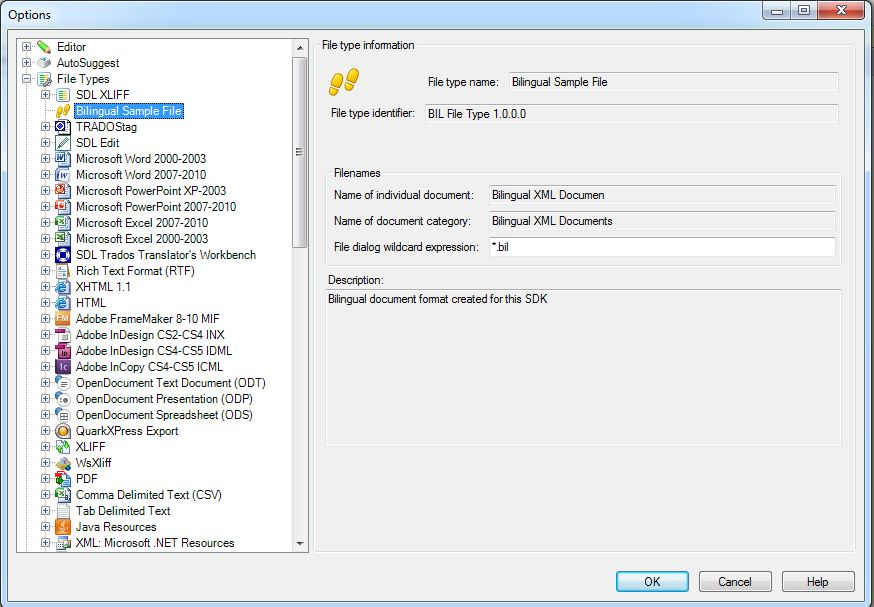

Adding the File Type Component Builder
==

Add the File Type Component Builder to your project. You will need to explicitly implement the interface [IFileTypeComponentBuilder](../../api/filetypesupport/Sdl.FileTypeSupport.Framework.IntegrationApi.IFileTypeComponentBuilder.yml)


```cs
public class SimpleTextFilterComponentBuilder : IFileTypeComponentBuilder
```

The component builder contains the complete implementation of the File Type Component Builder. It is used to declare and define the new file type plug-in to the framework, so that it can be used in <Var:ProductName>.

Add the File Type Information
--

Your File Type Component Builder needs to contain information such as the file type plug-in version number, the extension of the files that this file type plug-in applies to, etc. This kind of information is shown to users in the **Options** dialog box of <Var:ProductName> below **File Types**.

We recommend that you add a resources file to your assembly and call it e.g. **Resources.resx**. Then enter some general information strings such as the file type version, description, etc. into this resources file. These strings (and the embedded assembly icon) are then referenced in the [IFileTypeComponentBuilder](../../api/filetypesupport/Sdl.FileTypeSupport.Framework.IntegrationApi.IFileTypeComponentBuilder.yml) implementation. File Type Component Builder. Below is an example of the strings that you should provide in the resources file:


The [IFileTypeComponentBuilder](../../api/filetypesupport/Sdl.FileTypeSupport.Framework.IntegrationApi.IFileTypeComponentBuilder.yml) implementation contains references to each component of your file type plug-in, e.g. file sniffers, file parsers, etc. If you fail to reference a component in the file type definition, the functionality of the undeclared component cannot be used in <Var:ProductName>. The File Type Component Builder thereby fully reflects the component structure of the file type plug-in. At this point, we would like to underline the importance of sub-dividing your file type plug-in into distinct components, as each component performs a different, even if sometimes similar, task. The File Type Component Builder file can also contain the values of certain plug-in settings that users can change at runtime. Let us start by adding the general file type information to the [IFileTypeComponentBuilder](../../api/filetypesupport/Sdl.FileTypeSupport.Framework.IntegrationApi.IFileTypeComponentBuilder.yml) implementation as shown below:

```cs
/// <summary>
/// Returns a file type information object.
/// </summary>
/// <param name="name">The <see cref="IFileTypeDefinition"/> will pass "" as the name for this parameter</param>
/// <returns>an SimpleText file type information object</returns>
public IFileTypeInformation BuildFileTypeInformation(string name)
{
    var info = this.FileTypeManager.BuildFileTypeInformation();

    info.FileTypeDefinitionId = new FileTypeDefinitionId("BIL File Type 1.0.0.0");
    info.FileTypeName = new LocalizableString("Bilingual Sample File");
    info.FileTypeDocumentName = new LocalizableString("Bilingual XML Documen");
    info.FileTypeDocumentsName = new LocalizableString("Bilingual XML Documents");
    info.Description = new LocalizableString("Bilingual document format created for this SDK");
    info.FileDialogWildcardExpression = "*.bil";
    info.DefaultFileExtension = "bil";
    info.Icon = new IconDescriptor(PluginResources.bil);
    info.Enabled = true;

    return info;
}
```

If you added the File Type Component Builder to <Var:ProductName>, it would appear in the **Options** dialog box as illustrated below. The file type plug-in will be listed under **File Types**. However, of course it will not have any functionality yet. Below you see an example of how the information entered in the File Type Component Builder is presented to the user through the UI of <Var:ProductName>:




Of course, a File Type Component Builder file is a lot more comprehensive than what is shown above. As we develop each component of our sample file type plug-in, we will add the corresponding component references to the File Type Component Builder file step by step.

>**!NOTE**
>
> This content may be out-of-date. To check the latest information on this topic, inspect the libraries using the Visual Studio Object Browser.