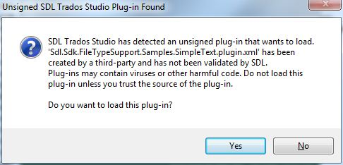

Build the File Type Plug-in
==

This chapter contains important information on building your file type plug-in and on the plug-in package file, which is created during the building process.

The Plug-in Package
--

Building the project will generate a **.sdlplugin* file, in our example Sdl.Sdk.FileTypeSupport.Samples.SimpleText.sdlplugin, which will be placed inside your build output path. The **.sdlplugin* file is technically speaking a ZIP archive that contains the required plug-in components such as the plug-in binary (*.dll itself), the resources file, the manifest etc. For our example, the **.sdlplugin* file will contain the following:

* The plug-in assembly, e.g. **Sdl.Sdk.FileTypeSupport.Samples.SimpleText.dll**
* The plug-in manifest, e.g. **Sdl.Sdk.FileTypeSupport.Samples.SimpleText.plugin.xml**. The manifest lists information on any extension classes that the plug-in contains. It is this manifest that will be created during the build process. It declares the assembly and the corresponding extension classes to <Var:ProductName>. By deleting this manifest **.xml* file you would actually deactivate the plug-in and 'hide' it from the application.
* The plug-in resources file, e.g. **Sdl.Sdk.FileTypeSupport.Samples.SimpleText.plugin.resources**. This resources file contains all the localizable strings and images referred to within the plug-in manifest, and is compiled from **PluginResources.resx** (see also The [Resources File](the_resource_file.md)).

The Plug-in Package Path
--
In order for <Var:ProductName> to pick up the plug-in package and to extract it, the following folders need to be available on your hard drive:

**For Windows XP**:

*C:\Documents and Settings\<UserName>\Application Data\SDL\SDL Trados Studio\14\Plugins\Packages*

and

*C:\Documents and Settings\<UserName>\Application Data\SDL\SDL Trados Studio\14\Plugins\Unpacked*

**For Windows Vista\Windows 7\Windows 8**:

*C:\Users\<UserName>\AppData\Roaming\SDL\SDL Trados Studio\14\Plugins\Packages*

and

*C:\Users\<UserName>\AppData\Roaming\SDL\SDL Trados Studio\14\Plugins\Unpacked*

Make sure that you place the **.sdlplugin* file into the sub-folder Packages and launch <Var:ProductName>. During startup of <Var:ProductName> the content of the package will be automatically extracted to the Unpacked sub-folder, as illustrated below:

The above folder does not have to be the build output path, but it is convenient to build the project in this folder, as this will also create the **.sdlplugin* file where it needs to be. After creating the plug-in based on the (empty) template, you could already build the project. However, it will, of course, not offer any functionality.

Upon start-up <Var:ProductName> will load the unpacked plug-in and show the following message, which you can confirm with **Yes**, so that the plug-in gets loaded. This message appears when loading plug-ins that have not been certified by SDL, which could potentially be unsafe. The message can be avoided by submitting your plug-in to SDL for certification.



>**Note**
>
>If a user clicks **No** when the plug-in security message is displayed during start-up of <Var:ProductName>, the plug-in will not be shown in the application.


After loading the plug-in in <Var:ProductName>, you can confirm that the plug-in has been added by raising the corresponding dialog box through the menu command **Tools** -> **Plug-ins**. The Plug-ins dialog box should list the name of your newly created plug-in:


The Plug-in Manifest
--
One essential piece of information required in order to build the plug-in package this is the plug-in package manifest, which is defined in the file **pluginpackage.manifest.xml**. This file is part of the project template. If this manifest is missing, the project package cannot be built.

Below you see what the manifest of our sample plug-in looks like:

```xml
<?xml version="1.0" encoding="utf-8"?>
<PluginPackage xmlns="http://www.sdl.com/Plugins/PluginPackage/1.0">
  <PlugInName>Sdl.Sdk.FileTypeSupport.Samples.SimpleText</PlugInName>
  <Version>1.0</Version>
  <Description>Sdl.Sdk.FileTypeSupport.Samples.SimpleText</Description>
  <Author></Author>
  <RequiredProduct name="SDLTradosStudio" minversion="9.1" />
</PluginPackage>
```
The manifest contains the following information:
* **PlugInName**: indicates the friendly name of the plugin. This string be different from the name of the plug-in that is defined in PluginResources.resx. The reason for this is that a plug-in package can - in theory - contain multiple plug-ins, which need to be distinguished.
* **Version**: the version of the plug-in package. This information is used to detect any package updates upon start-up of <Var:ProductName>, and is therefore important.
* **Description**: descriptive information of the plug-in package.
* **Author**: the name of the plug-in developer.
* **RequiredProduct**: this string indicates which SDL product version is required to run the given plug-in. The information that you indicate here must include the minimum version, and can optionally include a maximum version.

Build and Debug Suggestions
--

Here are a couple of simple suggestions to help buld and debug your plug-in.

* Change your solution and project so that it runs <Var:ProductName> by default.
* Change your project so that it the output is directed to the <Var:ProductName> plug-in package directory - this will automatically deploy your plug-in. In Windows 7, the <Var:ProductName>plug-in package directory is stored in C:\Users\<UserName>\AppData\Roaming\SDL\SDL Trados Studio\10\Plugins\Packages.
* Change your project so that it deletes the previous unpacked version of your plug-in - this will ensure that Studio uses the latest version of your plug-in. This can be done using a post-build event.

```txt
rmdir /S /Q "C:\Users\<UserName>\AppData\Roaming\SDL\SDL Trados Studio\10\Plugins\Unpacked\Sdl.Sdk.FileTypeSupport.Samples.Bil"
```

See Also
--
**Other Resources**

[Creating a New Project](creating_a_new_project.md)


>**!NOTE**
>
> This content may be out-of-date. To check the latest information on this topic, inspect the libraries using the Visual Studio Object Browser.

