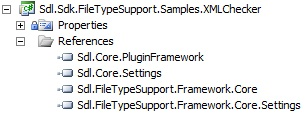

Create a New Project
===

In this chapter you will learn how to properly set up a project for developing a verification plug-in that works on the native file format.

Create the Project
--

After launching <Var:VisualStudioEdition> choose to create a new <Var:ProductName> Plug-in Project, and give it an appropriate name, e.g. *Sdl.Sdk.FileTypeSupport.Samples.XMLChecker*. The instructions for creating a <Var:ProductName> Plug-in Project are described in the **SDL Plug-in Framework** SDK under **SDL Trado Studio** > **Building a Plug-in**

<Var:ProductName> Plug-in Project produces a SDL Plug-in Package (.sdlplugin). This needs to be manually deployed or copied to the SDL Trados Studio Plug-in Packages directory so that SDL Trados Studio can use the plug-in. See **SDL Plug-in Framework SDK** under **SDL Trado Studio** > **Plug-in Deployment**.

Add the Required References
--

Next add the references from the SDL File Type Support Framework APIs. These are contained in the following assemblies:

* **Sdl.FileTypeSupport.Framework.Core.dll**: This is the main reference to the SDL File Type Support Framework API
* **Sdl.FileTypeSupport.Framework.Core.Settings.dll**

Then add the references from the Core APIs.
* **Sdl.Core.Settings.dll**
* **Sdl.Core.PluginFramework.dll**

By default you find these files in the <Var:ProductName> installation folder, usually *C:\Program Files\SDL\SDL Trados Studio\Studio5*. The **Copy Local** property for these references should be set to True.

>[!NOTE]
>
> This content may be out-of-date. To check the latest information on this topic, inspect the libraries using the Visual Studio Object Browser.