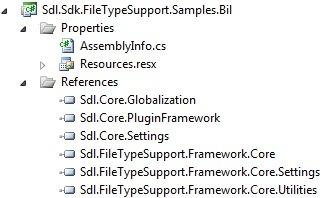

Creating a New Project
===

In this chapter you will learn how to properly set up a project for developing a bilingual file type plug-in.

Create the Project
-- 

After launching <Var:VisualStudioEdition> choose to create a new <Var:ProductName> Plug-in Project, and give it an appropriate name, e.g. *Sdl.Sdk.FileTypeSupport.Samples.Bil*. The instructions for creating a <Var:ProductName> Plug-in Project are described in the [Creating a New Project](creating_a_new_project.md) and [Build the File Type Plug-in](build_the_file_type_plug_in.md) topics.

Add the Required References
--

Next add the references from the  File Type Support Framework APIs. These are contained in the following assemblies:

* **Sdl.FileTypeSupport.Framework.Core.dll**: This is the main reference to the File Type Support Framework API
* **Sdl.FileTypeSupport.Framework.Core.Settings.dll**
* **Sdl.FileTypeSupport.Framework.Core.Utilities.dll**

Then add the references from the Core APIs.
* **Sdl.Core.Globalization.dll**
* **Sdl.Core.PluginFramework.dll**
* **Sdl.Core.Settings.dll**

By default you find these files in the <Var:ProductName> installation folder, usually *<Var:InstallationFolder>*. The **Copy Local** property for these references should be set to True.

Remember to generate a key to sign the assembly. It is also recommended that you set **SDLTradosStudio.exe** as the external application for debugging purposes.

Add the Required Resources
--

Add a resources file (*Resources.resx*) to the project's properties. We will use this resources file later for storing information text on the file type plug-in that will be exposed in the user interface of <Var:ProductName>.

Add an icon to the project. You will find a suitable icon file (*Bil.ico*) in the folder **Sdl.Sdk.FileTypeSupport.Samples.Bil** of the SDK sample projects folder. Set the **Build Action** property for the icon file to **Embedded Resource**. The icon that you add to the project will be the one that users will later see in the **Options** dialog box of <Var:ProductName>.

>[!NOTE]
>
> This content may be out-of-date. To check the latest information on this topic, inspect the libraries using the Visual Studio Object Browser.
