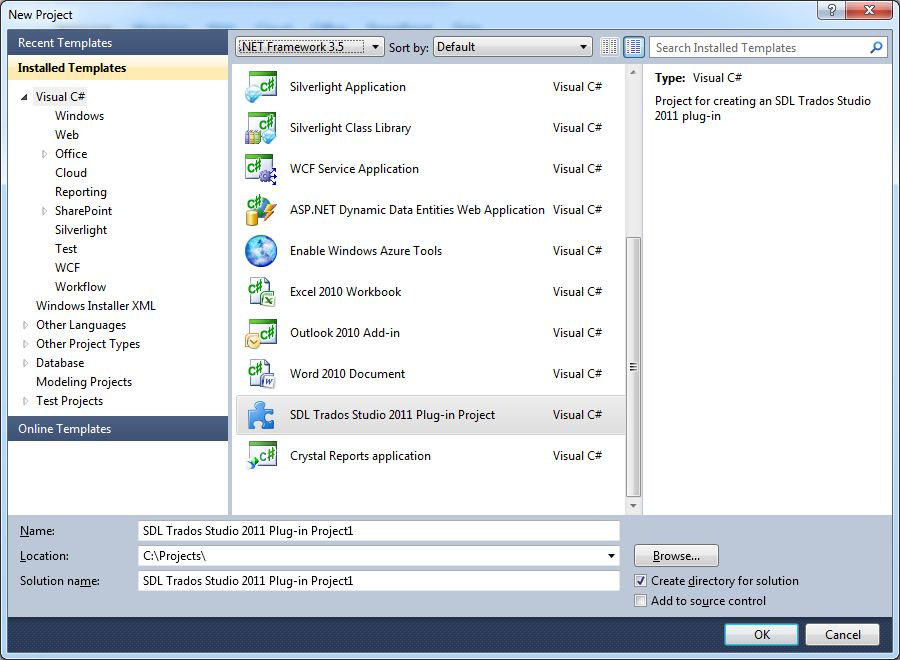
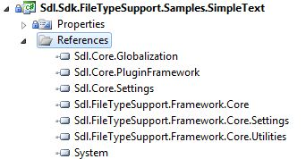

Creating a New Project
===
In this chapter you will learn how to properly set up a project for developing a file type plug-in.

Create the Project
--

Before you start developing plug-ins for <Var:ProductName>, you should make sure that the SDK is installed on your development computer. The SDK installer will add new templates to your Microsoft Visual Studio environment, as illustrated in the screenshot below. For the type of plug-in discussed in this chapter, we require the **<Var:ProductName> Plug-in Project** template.

By default, when you create a project based on this template, the project name will be e.g. **<Var:ProductName> Plug-in Project1**. Change the project name to **Sdl.Sdk.FileTypeSupport.Samples.SimpleText** for our sample implementation.

Add the Required References
--

The plug-in template will come with the **Sdl.Core.PluginFramework.dll** reference. For our file type plug-in implementation, we also need to reference the File Type Support Framework, i.e. **Sdl.FileTypeSupport.Framework.Core.dll**. For implementing the functionality required by our example, you need to add the libraries used for integration with <Var:ProductName>, which are as follows:

* **Sdl.FileTypeSupport.Framework.Core.Settings.dll**
* **Sdl.Core.Settings.dll**
* **Sdl.Core.Globalization.dll**
* **Sdl.FileTypeSupport.Framework.Core.Utilities**

By default these files can be found in the installation folder of <Var:ProductName>, i.e. *<Var:InstallationFolder>*. The 'Copy Local' property for these references should be set to True.

>[!NOTE]
>
>Do not forget to sign the assembly. Otherwise, your plug-in might not be loaded by <Var:ProductName>

See Also
--

[What is the Verification Framework?](what_is_the_verification_framework.md)

>[!NOTE]
>
> This content may be out-of-date. To check the latest information on this topic, inspect the libraries using the Visual Studio Object Browser.