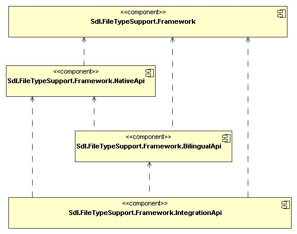

The Trados File Type Support Framework 2 API (from now File Type Support Framework), is one of the core parts of <var:ProductName>. The File Type Support Framework allows developers to develop file type plug-ins that extract translatable text from various file formats such as MS Word Doc files, HTML, XML, Text etc. The translatable source and (optionally) target text can then be imported and converted into an intermediate file format that is designed to be compatible with the OASIS XLIFF format (with SDL extensions) - [SDLXliff](#sdlxliff).

This data format contains both source and target text and any mark-up data or tags that the file filter has found. These tags can be either paired or placeholder tags, which can be moved deleted or cloned in the translation. They can also be structure tags that represent fixed non-translatable elements in the original file format, which must be preserved. Other applications such as the editor or the translation memory subsystems also use this framework to interact with the given file formats and can read and update these structures as required.

The core APIs of the File Type Support Framework consist of the following <Var:DotNetVersion> assemblies:



Below you find a brief description of what each assembly contains:

* [Sdl.FileTypeSupport.Framework](../../api/filetypesupport/Sdl.FileTypeSupport.Framework.yml): contains basic data types that are shared between all the moduels, e.g. the ```FrameworkException``` base class, the ```Language``` and ```Codepage``` classes, etc.
* [Sdl.FileTypeSupport.Framework.NativeApi](../../api/filetypesupport/Sdl.FileTypeSupport.Framework.NativeApi.yml): contains all interfaces required to build file type plug-in components that convert native files to streams of localizable content such as tags and text, including components that work on such streams. It also contains some abstract base classes and helpers that can be used in an implementation.
* [Sdl.FileTypeSupport.Framework.BilingualApi](../../api/filetypesupport/Sdl.FileTypeSupport.Framework.BilingualApi.yml): contains the interfaces for the bilingual object model and everything that is required to build components that operate on it. It also contains abstract base classes and helpers that can be useful in an implementation.
* [Sdl.FileTypeSupport.Framework.IntegrationApi](../../api/filetypesupport/Sdl.FileTypeSupport.Framework.IntegrationApi.yml): contains the interfaces with the functionality the File Type Support Framework exposes to applications that integrate and use it.

Native and Bilingual Content
---

Filtered content can be processed in two different ways, depending on the phase of the conversion process:

* As a stream of monolingual 'native' content items such as tags and text.
* As bilingual (source and target language) content in an object model, delivered as a stream of 'paragraph units'.
The native components are used to read and write content in a single (source or target) language from/to the original ('native') file type and to perform associated pre- and post processing tasks.

The bilingual content model is used for all processing of data during the localization phase. In the bilingual content localization-specific information such as segment boundaries, word counts and TM matches can be directly associated with the content.

The transition between native and bilingual content processing is handled by specific converters. The conversion from native to bilingual content involves building source language paragraph units from the stream of content. The conversion from bilingual to native involves converting the source or target language annotated data into a stream of content.

File Type Plug-in
---
A file type plug-in is a set of components that together perform operations on native documents. Which components are used for what task and how they are connected to perform different tasks is defined in a **File Type Component Builder**.

A file type plug-in is used to perform the following actions:

* Reading the native file content and converting it into the source language representation of a bilingual content model, which can then be processed for translation (extraction).
* Converting back the source or target language of a bilingual content model into the source or target language version of the original (native) file type (generation).

These two types of processing can be combined as part of performing conversions to and from the original file type. The File Type Component Builder specifies which native and bilingual processing components should be applied during conversion. When reading a file in native format the native processing components are applied to the content stream before the bilingual components. When converting back from the bilingual representation into the native format the order is reversed, i.e. bilingual components are applied to the content stream before the native components.

Bilingual File Formats
---

The framework can also be used for reading and writing data stored in bilingual formats. Bilingual file types can be treated like any other file type by the framework, they simply process data directly in the bilingual content model.

The ability to write file type plug-ins for bilingual file formats means that you can support file types such as partially translated TTX, ITD, BIF, Workbench RTF, generic XLIFF or any types of 'home grown' file formats used for storing multilingual content.

At the time of writing, standard file type plug-ins for TTX, ITD and XLIFF are available.

We also use a default bilingual file format for serializing the entire bilingual content model during the localization process.

SDLXliff
---
This file format is fully based on and compliant with the OASIS XLIFF 1.2 standard. SDLXliff can store all metadata available in the bilingual content model of the File Type Support Framework. Standard XLIFF constructs are used whenever possible, and valid XLIFF extension points are used when necessary to store the additional information.

The SDL extensions to the XLIFF 1.2 schema are defined in a separate schema file, which is embedded as a resource in the assembly and used for validation of the XLIFF files when this option is enabled in the file type plug-in.

The SDLXliff file type plug-in is defined in the assembly ```Sdl.FileTypeSupport.Bilingual.SdlXliff```. Note that this is treated like any other file type plug-in. Applications should not need to reference this assembly.

   

>[!NOTE]
>
> This content may be out-of-date. To check the latest information on this topic, inspect the libraries using the Visual Studio Object Browser.

