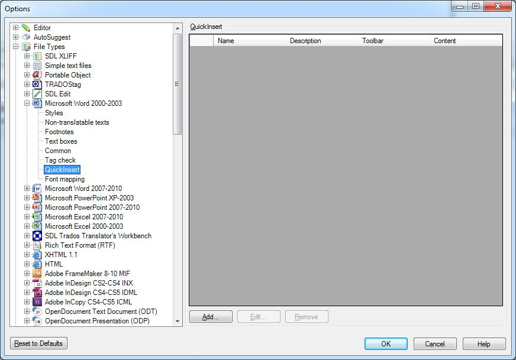
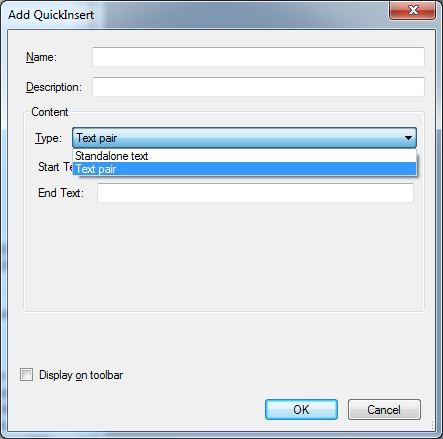

Implementing QuickInsert Functionality
===

QuickInsert allows you to further enhance your file type plug-in by adding functionality that allows users to quickly insert inline tags, placeholders, strings (or string pairs), characters that are difficult to type on some keyboards (e.g. ç, ©), etc.

About QuickInsert
--

QuickInsert (formerly QuickTag) allows the insertion of bilingual content into the localizable document using the buttons on the **QuickInsert** toolbar of <Var:ProductName>. The bilingual content consists of bilingual SDL File Type Support Framework items such as [ITagPair](../../api/filetypesupport/Sdl.FileTypeSupport.Framework.BilingualApi.ITagPair.yml), [IPlaceholderTag](../../api/filetypesupport/Sdl.FileTypeSupport.Framework.BilingualApi.IPlaceholderTag.yml), [IText](../../api/filetypesupport/Sdl.FileTypeSupport.Framework.BilingualApi.IText.yml), [Location](../../api/filetypesupport/Sdl.FileTypeSupport.Framework.BilingualApi.Location.yml), [ICommentMarker](../../api/filetypesupport/Sdl.FileTypeSupport.Framework.BilingualApi.ICommentMarker.yml), or [ILockedContent](../../api/filetypesupport/Sdl.FileTypeSupport.Framework.BilingualApi.ILockedContent.yml).

QuickInsert allows users to insert various items into their target segments:

* **Inline tags**: for example, tag pairs that apply bold formatting
* **Text pairs**: start and end text to be inserted before and after the current selection, for example, German smart quotes to be inserted before and after the selection
* **Standalone text**: simple pieces of text, e.g. special characters like ®, which replaces the current selection when inserted

QuickInsert items can be specific to particular file types. For example, HTML uses **B** tags to apply bold formatting, while DOC files use **CF** tags. Therefore, each file type plug-in can be associated with its own set of QuickInsert items.

Below you see an example of how the standard Microsoft Word 2007 file type plug-in is associated with a QuickInsert settings page that lists all the QuickInsert items defined for this file type plug-in.

>[!NOTE]
>
>In the UI only QuickInserts specified by user are displayed, the default QuickInserts are only displayed on the <Var:ProductName> toolbar.



When you open a DOC file in <Var:ProductName>, the QuickInsert toolbar will look as shown below:


Since we have not assigned any QuickInsert items to our sample file type plug-in, the toolbar will look like this after opening a **.text* file:


Apart from some default assignments of characters that can be used in any format, e.g. dash, copyright, etc., all other toolbar buttons are greyed-out (i.e. not assigned).

Some of the inactive buttons are by default intended for applying particular types of common character formatting, e.g. bold, underline, etc. Since every format uses different tags for applying these types of formatting, the corresponding QuickInsert assignments have to be made on a file type plug-in-specific basis


Then, there are a number of unassigned buttons that are intended for receiving customized QuickInsert items, e.g. formatting not covered by the default formatting buttons, strings, string pairs, etc. The generic icons of these buttons can be changed programmatically or through the user interface.


Modify the File Type Component Builder
--

To associate your sample file type plug-in with a settings page that lists the QuickInsert items, the following code was used in the class **SimpleTextFilterComponentBuilder** within the method **BuildFileTypeInformation**.

# [C#](#tab/tabid-1)
```cs
info.WinFormSettingsPageIds = new string[]
{
    "SimpleText_Settings",
    "QuickInserts_Settings",
};
```
***

**WinFormSettingsPageIds** specifies the ids of the settings pages to be associated with a file type plug-in. Here we added **QuickInserts_Settings** so that a settings page that lists the QuickInsert items is associated with this file type plug-in. This code was added in an earlier chapter and so should not be added again.

Since a this **QuickInsert** settings page has been associated, a **QuickInsert** link will be shown below your sample file type plug-in in the **Options** dialog box of <Var:ProductName>. This is the first time that you have implemented a user interface for your file type plug-in, however, the QuickInsert list is, of course, empty.

By clicking **Add** you could define your own QuickInsert items. However, this standard user interface is limited insofar as it only allows you to define items for standalone text and text pairs.




Define QuickInsert Items Programmatically
--

You could add QuickInsert items through the user interface and thus deploy them in the settings export format (**.sdlfiletype* file). However, as mentioned above, this approach has its limitations. Generating QuickInsert items programmatically gives you full control over the QuickInsert mechanism.

Let us assume you want to assign a **B** tag pair to the corresponding default button in the QuickInsert toolbar and assign German quotes (i.e. a text pair) to one of the custom QuickInsert buttons.

Start by adding a class called e.g. **QuickInsertBuilder.cs** to your project. The class needs to be derived from [AbstractQuickTagBuilder](../../api/filetypesupport/Sdl.FileTypeSupport.Framework.Core.Utilities.IntegrationApi.AbstractQuickTagBuilder.yml). Your class needs to reference the namespace **Sdl.FileTypeSupport.Framework.Core.Utilities.IntegrationApi**. Below you see an example of an implementation that assigns the appropriate tag pair to the standard bold formatting button and a text pair (German quotes) to the first custom QuickInsert button.

# [C#](#tab/tabid-2)
```cs
using System.Collections.Generic;
using Sdl.FileTypeSupport.Framework.IntegrationApi;
using Sdl.FileTypeSupport.Framework.Core.Utilities.IntegrationApi;

namespace Sdl.Sdk.FileTypeSupport.Samples.SimpleText
{
    class QuickInsertBuilder : AbstractQuickTagBuilder
    {
        public static IList<IQuickTag> BuildStandardQuickTags()
        {
            QuickInsertBuilder builder = new QuickInsertBuilder();
            return builder.CreateStandardQuickTags();
        }

        internal IList<IQuickTag> CreateStandardQuickTags()
        {
            IList<IQuickTag> quickTags = new List<IQuickTag>();

            // assign the default tag pair button for
            // applying bold formatting
            quickTags.Add(CreateDefaultTagPair(QuickTagDefaultId.Bold, "<b>", "</b>", "b"));

            // assign a German quotes text pair to 
            // the first custom QuickInsert botton
            quickTags.Add(CreateTextPair("dequot", // command id
                StringResources.DeQuot_Command_Name, // command name
                StringResources.DeQuot_Command_Description, // command description 
                "„", // start string, i.e. opening quote
                "“", // end string, i.e. ending quote
                "", "", "")); // display text, not required for text pairs, therefore left empty


            IList<IQuickTag> bidiTags = CreateDefaultBidiQuickTags();

            foreach (IQuickTag tag in bidiTags)
            {
                quickTags.Add(tag);
            }
            return quickTags;
        }
    }
}
```
***

Add the quick insert builder component to the File Type Component Builder by inserting the following code to your implementation of the [IFileTypeComponentBuilder](../../api/filetypesupport/Sdl.FileTypeSupport.Framework.IntegrationApi.IFileTypeComponentBuilder.yml) interface. If you do not add the quick insert builder then this component will never be used by the file type plug-in, even if the quick insert builder component has been implemented in the assembly.

# [C#](#tab/tabid-3)
```cs
public IQuickTagsFactory BuildQuickTagsFactory(string name)
{
    IQuickTagsFactory quickTags = FileTypeManager.BuildQuickTagsFactory();
    quickTags.GetQuickTags(null).SetStandardQuickTags(QuickInsertBuilder.BuildStandardQuickTags());
    return quickTags;
}
```
***


Note that you need to add the following names and values to the **StringResources** file:


The QuickInsert toolbar for your file type plug-in should now look as shown below:


See Also
--


[Using QuickInserts](using_quickinserts.md)


>[!NOTE]
>
> This content may be out-of-date. To check the latest information on this topic, inspect the libraries using the Visual Studio Object Browser.