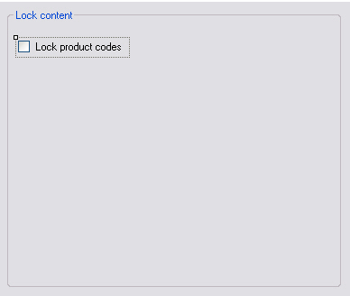

Implementing the Settings UI
==
In this chapter you will learn how to expose file type plug-in configuration settings through a user interface.

Add an Option to Lock Product Codes
==

Start by adding a user control element to your WinUI project, which you can call, for example, **SettingsUI.cs**. Add a group box and a check box (named ```cb_LockPrdCodes```) to the control, which should look as shown below:




As product codes should be locked by default, set the **Checked** property to True.

Your **SettingsUI** class needs to use the following namespace:

* **Sdl.FileTypeSupport.Framework.Core.Settings**

The Settings Bundle
--

Each plug-in uses a settings bundle to store and retrieve settings. The mechanism for doing that is provided in a separate class called **UserSettings**, which we will implement later ([Loading and Saving the Settings](loading_and_saving_settings.md)). For now, we create an object based on the **UserSettings** class:

```cs
private UserSettings _userSettings;
```

So that we can obtain the correct user settings for this settings page from the Filter Framework, we need to tell the framework which settings we need. We can do this by implementing [IFileTypeSettingsAware](../../api/filetypesupport/Sdl.FileTypeSupport.Framework.Core.Settings.IFileTypeSettingsAware-1.yml):

```cs
public partial class SettingsUI : UserControl, IFileTypeSettingsAware<UserSettings>
```

Initialize the Plug-in User Interface Settings
When the user raises the plug-in user interface, the control element should be set according to what is stored in the settings bundle. This is handled by setting the _userSettings object (which we declared previously) and implementing the Settings property from [IFileTypeSettingsAware](../../api/filetypesupport/Sdl.FileTypeSupport.Framework.Core.Settings.IFileTypeSettingsAware-1.yml).


```cs
public UserSettings Settings
{
    get
    {
        return _userSettings;
    }
    set
    {
        _userSettings = value;
        UpdateControl();
    }
}
```

During initialization the ```UpdateControl``` method is invoked, which sets the state of the check box (checked or unchecked) to the value of the LockPrdCodes member of the ```UserSettings``` class as shown below:

```cs
public void UpdateControl()
{
    cb_LockPrdCodes.Checked = _userSettings.LockPrdCodes;
}
```

Save the Settings to the Settings Bundle
--

Conversely, the user interface needs to save the check box setting to the settings bundle, e.g. when the user raises the plug-in UI, changes the check box setting, and then clicks **OK** to apply the changed setting to the settings bundle:

```cs
private void cb_LockPrdCodes_CheckedChanged(object sender, EventArgs e)
{
    _userSettings.LockPrdCodes = cb_LockPrdCodes.Checked;
}
```
Putting it All Together
--

The full code of your user control looks as shown below:

```cs
using System;
using System.Collections.Generic;
using System.ComponentModel;
using System.Drawing;
using System.Data;
using System.Linq;
using System.Text;
using System.Windows.Forms;
using Sdl.FileTypeSupport.Framework.Core.Settings;

namespace Sdl.Sdk.FileTypeSupport.Samples.SimpleText.WinUI
{
    /// <summary>
    /// Implements the user interface for the file type definition.
    /// </summary>
    #region "ClassDeclaration"
    public partial class SettingsUI : UserControl, IFileTypeSettingsAware<UserSettings>
    #endregion
    {
        /// <summary>
        /// Create a settings object based on the UserSettings class. 
        /// </summary>
        #region "SettingsObject"
        private UserSettings _userSettings;
        #endregion

        /// <summary>
        /// Initalize the user interface control by setting it to the
        /// setting value stored in the settings bundle.
        /// </summary>
        #region "Initialize"
        public SettingsUI()
        {
            InitializeComponent();
        }
        #endregion


        /// <summary>
        /// Reset the user interface control to its default value, which is
        /// checked, i.e. the product lock option should be enabled
        /// by default.
        /// </summary>
        #region "UpdateControl"
        public void UpdateControl()
        {
            cb_LockPrdCodes.Checked = _userSettings.LockPrdCodes;
        }
        #endregion

        /// <summary>
        /// Save the settings based on the value of the the check box.
        /// The setting is saved through the UserSettings class, which
        /// handles the plug-in settings bundle.
        /// </summary>
        /// <param name="sender"></param>
        /// <param name="e"></param>
        #region "SaveSetting"
        private void cb_LockPrdCodes_CheckedChanged(object sender, EventArgs e)
        {
            _userSettings.LockPrdCodes = cb_LockPrdCodes.Checked;
        }
        #endregion

        /// <summary>
        /// Implementation of <code>IFileTypeSettingsAware</code> allowing the Filter Framework
        /// to pass through the user settings so that we can initialize the UI.
        /// </summary>
        #region "ApplySettings"
        public UserSettings Settings
        {
            get
            {
                return _userSettings;
            }
            set
            {
                _userSettings = value;
                UpdateControl();
            }
        }
        #endregion
    }
}
```
See Also
--

**Other Resources**

[Creating a New Assembly for the Settings UI](creating_a_new_assembly_for_the_settings_ui.md)

[Implementing the UI Controller Class](implementing_the_ui_controller_class.md)

[File type settings](file_type_settings.md)

[Loading and Saving the Settings](loading_and_saving_settings.md)

>**NOTE**
>
> This content may be out-of-date. To check the latest information on this topic, inspect the libraries using the Visual Studio Object Browser.