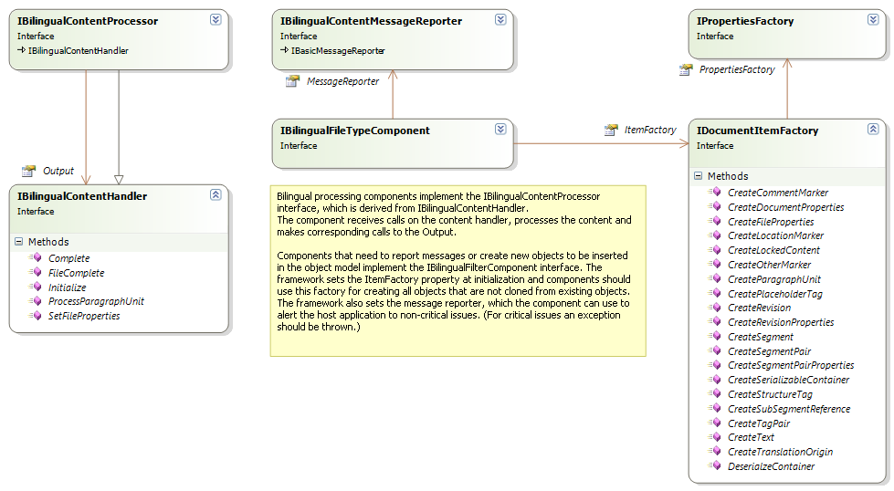
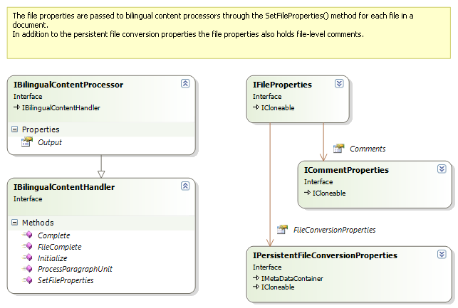
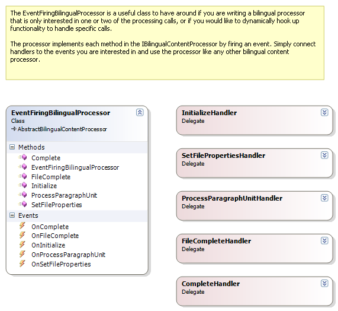
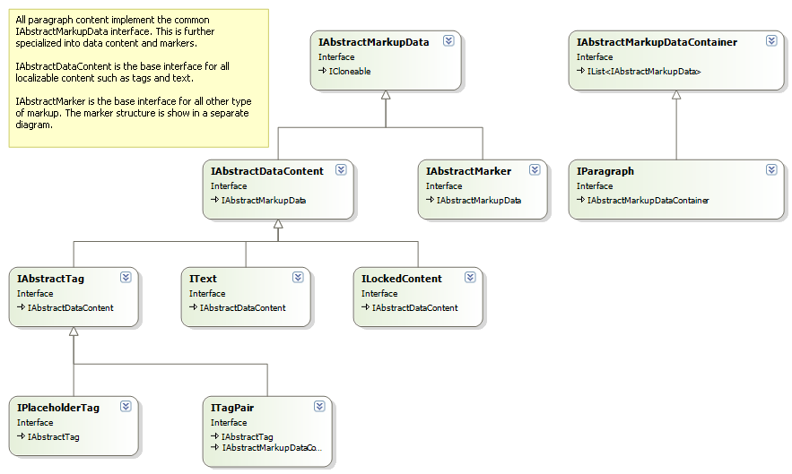
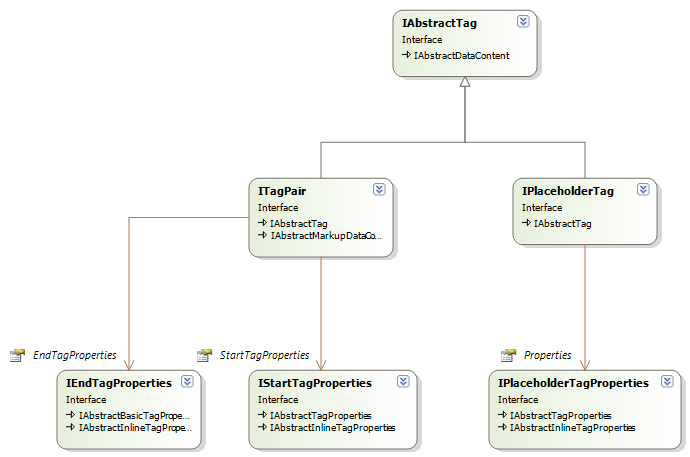
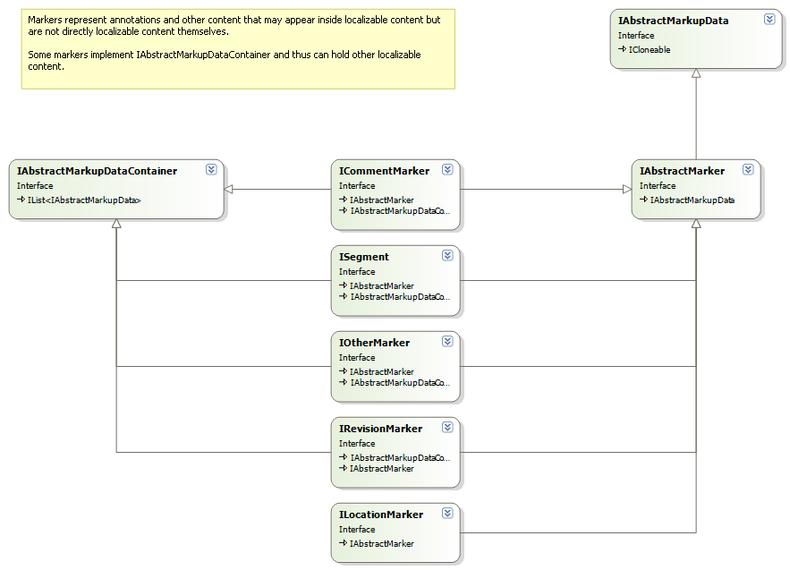

Overview of the Bilingual API
==

This section contains a quick overview of the Bilingual API. For detailed documentation on individual interfaces, properties, methods etc. see the reference documentation.

Bilingual processor components implement the IBilingualContentProcessor interface, which the framework calls to let the component process content in a bilingual object model one paragraph unit at a time.



The content is delivered to the components through calls to [ProcessParagraphUnit](../../api/filetypesupport/Sdl.FileTypeSupport.Framework.BilingualApi.AbstractBilingualContentProcessor.yml#Sdl_FileTypeSupport_Framework_BilingualApi_AbstractBilingualContentProcessor_ProcessParagraphUnit_Sdl_FileTypeSupport_Framework_BilingualApi_IParagraphUnit_). The [Initialize](../../api/filetypesupport/Sdl.FileTypeSupport.Framework.BilingualApi.AbstractBilingualContentProcessor.yml#Sdl_FileTypeSupport_Framework_BilingualApi_AbstractBilingualContentProcessor_Initialize_Sdl_FileTypeSupport_Framework_BilingualApi_IDocumentProperties_) method is invoked before any content is passed through the component, and it communicates the document properties which are common for all files in the document. For each native file in the bilingual document the framework calls [SetFileProperties](../../api/filetypesupport/Sdl.FileTypeSupport.Framework.BilingualApi.AbstractBilingualContentProcessor.yml#Sdl_FileTypeSupport_Framework_BilingualApi_AbstractBilingualContentProcessor_SetFileProperties_Sdl_FileTypeSupport_Framework_BilingualApi_IFileProperties_) before the content of the file is processed. When all content in a file has been processed the framework calls [FileComplete](../../api/filetypesupport/Sdl.FileTypeSupport.Framework.BilingualApi.AbstractBilingualContentProcessor.yml#Sdl_FileTypeSupport_Framework_BilingualApi_AbstractBilingualContentProcessor_FileComplete) and when all files in a document have been processed the framework calls Complete.

The file properties passed through the [SetFileProperties](../../api/filetypesupport/Sdl.FileTypeSupport.Framework.BilingualApi.AbstractBilingualContentProcessor.yml#Sdl_FileTypeSupport_Framework_BilingualApi_AbstractBilingualContentProcessor_SetFileProperties_Sdl_FileTypeSupport_Framework_BilingualApi_IFileProperties_) call can be used to retrieve the persistant file conversion settings, where components can store and retrieve important settings related to the data being processed.



The ```EventFiringBilingualProcessor``` is an implementation of the [IBilingualContentProcessor](../../api/filetypesupport/Sdl.FileTypeSupport.Framework.BilingualApi.IBilingualContentProcessor.yml) interface that is convenient to use when you are only interested in processing one or two of these calls. That implementation simply fires events for each of the calls and you can hook up your event handler to the one you are interested in. (This is very handy especially when writing unit tests.)



Paragraph units can be devided into two types: structure paragraph units and localizable paragraph units. Structure paragraph units contain only structural data (i.e. structure tags), they have no directly localizable content. Localizable paragraph units contain text and tags that are modified during translation. Both types of paragraph units are processed in the [ProcessParagraphUnit](../../api/filetypesupport/Sdl.FileTypeSupport.Framework.BilingualApi.AbstractBilingualContentProcessor.yml#Sdl_FileTypeSupport_Framework_BilingualApi_AbstractBilingualContentProcessor_ProcessParagraphUnit_Sdl_FileTypeSupport_Framework_BilingualApi_IParagraphUnit_) call, the implementation must check the [IsStructure](../../api/filetypesupport/Sdl.FileTypeSupport.Framework.BilingualApi.IParagraphUnit.yml#Sdl_FileTypeSupport_Framework_BilingualApi_IParagraphUnit_IsStructure) property to determine which type each is.


A localizable paragraph unit can have the following main properties:


The source and target language content in a paragraph is comprised of objects that implement [IMarkupDataVisitor](../../api/filetypesupport/Sdl.FileTypeSupport.Framework.BilingualApi.IMarkupDataVisitor.yml) derived interfaces:



Here is a diagram with some more details on the inline tags:



Tags and text inside a paragraph can be annotated with different types of markup, represented with [IAbstractMarker](../../api/filetypesupport/Sdl.FileTypeSupport.Framework.BilingualApi.IAbstractMarker.yml) as base interface:



The most important type of markup is segments. A segment is uniquely identified *within the paragraph unit* through its segment ID. As segment in a localized paragraph unit always has a source/target language counterpart. The source and target language segments reference the same [ISegmentPair](../../api/filetypesupport/Sdl.FileTypeSupport.Framework.BilingualApi.ISegmentPair.yml) object, and thus implicitly will always have the same segment ID. The corresponding source/target segment can be easily retrieved through the [GetSourceSegment](../../api/filetypesupport/Sdl.FileTypeSupport.Framework.BilingualApi.IParagraphUnit.yml#Sdl_FileTypeSupport_Framework_BilingualApi_IParagraphUnit_GetSourceSegment_Sdl_FileTypeSupport_Framework_NativeApi_SegmentId_) and [GetTargetSegment](../../api/filetypesupport/Sdl.FileTypeSupport.Framework.BilingualApi.IParagraphUnit.yml#Sdl_FileTypeSupport_Framework_BilingualApi_IParagraphUnit_GetTargetSegment_Sdl_FileTypeSupport_Framework_NativeApi_SegmentId_) methods, which take the segment ID as parameter and returns the corresponding object.

Navigation and iteration through the bilingual content in a paragraph or other markup data container can be achieved in a number of different ways. Perhaps the most intuitive is to use the ```Parent```, ```IndexInParent``` and ```Items``` properties to directly access related nodes, or by iterating over all items in an [IAbstractMarkupDataContainer](../../api/filetypesupport/Sdl.FileTypeSupport.Framework.BilingualApi.IAbstractMarkupDataContainer.yml) either directly or through the [AllSubItems](../../api/filetypesupport/Sdl.FileTypeSupport.Framework.BilingualApi.IAbstractMarkupDataContainer.yml#Sdl_FileTypeSupport_Framework_BilingualApi_IAbstractMarkupDataContainer_AllSubItems) property of the container, or by calling the [ForEachSubItem](../../api/filetypesupport/Sdl.FileTypeSupport.Framework.BilingualApi.IAbstractMarkupDataContainer.yml#Sdl_FileTypeSupport_Framework_BilingualApi_IAbstractMarkupDataContainer_ForEachSubItem_System_Action_Sdl_FileTypeSupport_Framework_BilingualApi_IAbstractMarkupData__) method passing in an action object.

The [Location](../../api/filetypesupport/Sdl.FileTypeSupport.Framework.BilingualApi.Location.yml) class provides another flexible way of iterating through and working with the localizable content in a paragraph:


Localizable content can also be processed through a visitor pattern. This is often useful when dealing with collections of objects (e.g. in markup data containers), as the use of a visitor avoids having to construct awkward and difficult to maintain ```switch```/```if``` statements to test for different object types. Simply call ```AcceptVisitor``` on the object, and the object will call back to its corresponding method on the visitor. For more information about the Visitor pattern, see *Design Patters* by the “Gang of Four” (Gamma, Helm, Johnson, Vlissides), a book that should be on every developer's desk.


>**NOTE**
>
> This content may be out-of-date. To check the latest information on this topic, inspect the libraries using the Visual Studio Object Browser.