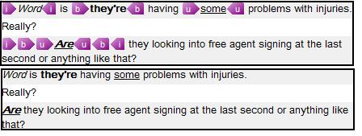

Text Formatting
==

Complex documents often contain formatting and various styles. For example, most editors will support character formats such as **Bold**, *Italic* and <u>Underline</u>.

The purpose of semi-WYSIWYG formatting support is to allow for any framework editor (i.e. an editor built on top of the framework) to display some level of character formatting information based on common formatting types supported by the framework. Thus, the formatting supported by a specific external editor such as Microsoft Word will be converted by a native processor object (at parseing time) into the framework's semi-WYSIWYG formatting objects. These semi-WYSIWYG formatting objects of the framework can be persisted to a bilingual file format, as indeed they are, for the framework XLIFF file format and read back in by the framework when opening such a document.

To apply character formatting, the [Sdl.FileTypeSupport.Framework.Formatting](../../api/filetypesupport/Sdl.FileTypeSupport.Framework.Formatting.yml) class is used. This class contains basic formatting properties which can be used in native or bilingual filters.

Formatting properties should be always applied to [IStartTagProperties](../../api/filetypesupport/Sdl.FileTypeSupport.Framework.NativeApi.IStartTagProperties.yml) and you can assign multiple [IFormattingItem](../../api/filetypesupport/Sdl.FileTypeSupport.Framework.Formatting.IFormattingItem.yml) items to one ```Formatting``` property. The text will receive all the formatting that is defined in the opening tag.

[IStartTagProperties](../../api/filetypesupport/Sdl.FileTypeSupport.Framework.NativeApi.IStartTagProperties.yml) and [IEndTagProperties](../../api/filetypesupport/Sdl.FileTypeSupport.Framework.NativeApi.IEndTagProperties.yml) have [CanHide](../../api/filetypesupport/Sdl.FileTypeSupport.Framework.NativeApi.IAbstractInlineTagProperties.yml#Sdl_FileTypeSupport_Framework_NativeApi_IAbstractInlineTagProperties_CanHide) properties that allows user to hide tags. In order not to have a tag displayed in the editor, set the CanHide property to True. Of course, the semiy-WYSIWYG formatting itself will still be visible. Below you see an example of how hidding tags makes the view for the translator simpler and more readable.



For tags that are meant to apply only character formatting, this property should be always set to True.

>[!NOTE]
>
> This content may be out-of-date. To check the latest information on this topic, inspect the libraries using the Visual Studio Object Browser.

