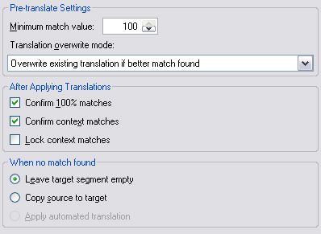

Pre-translate Settings
==

When matches for a given document are found in one or several TMs, you may want the target segments for all matching segments to be inserted automatically in one go, rather than having to insert the translations manually in the editor. This is what the pre-translate batch task does. This chapter provides information on the settings that you can configure for this task.


The screenshot below shows the settings that can be configured for the pre-translate task in <Var:ProductName>.



To configure the task settings programmatically, implement a helper function called     ```GetPretranslateTaskSettings```, which takes a [FileBasedProject]() object as parameter. The settings for a particular task are saved within the project. The settings can either apply to the entire project or can be target-language specific, e.g. when the German files require different settings than the French files. Each project is associated with a settings bundle, which contains the settings for all tasks (e.g. analyze, pre-translate, etc.). First, create a ```ISettingsBundle``` object by applying the ```GetSettings``` method to the project object. Then apply the ```GetSettingsGroup``` method to generate a settings object based on the [TranslateTaskSettings]() class:

```CS
ISettingsBundle settings = project.GetSettings();
TranslateTaskSettings pretranslateSettings = settings.GetSettingsGroup<TranslateTaskSettings>();
```

Afterwards, you configure the task-specific settings as follows:

**Setting the Minimum Match Score**

This is probably the most important setting. By default, segments are only pre-translated when an exact or a context match is found in a TM. However, you may also lower the minimum fuzzy match value to take, e.g. 90% matches into account. If you lower this setting to another value through the [MinimumMatchScore]() property, it is recommended to keep it within the high fuzzy range (e.g. 95%).

```CS
pretranslateSettings.MinimumMatchScore.Value = 95;
```

**Confirming Exact Matches**

When an exact (100%) match is found during pre-translating, the segment pair gets confirmed automatically by default. This means that when opening the document in the editor translators / editors will see an icon that states that this particular segment is confirmed, which is an indication that it usually does not require any further editing. You can change this default behavior by setting the [ConfirmAfterApplyingExactMatch]() property to False.

```CS
pretranslateSettings.ConfirmAfterApplyingExactMatch.Value = true;
pretranslateSettings.LockExactMatchSegments.Value = false;
```

**Confirming and Locking Context Matches**

The same principle applies to context matches, which are also confirmed by default. By setting the [ConfirmAfterApplyingInContextExactMatch]() property to False you can change this default behavior. In addition you can set the [LockContextMatchSegments]() property to True to lock all pre-translated context matches. This is an even stronger indication that this translation should not be changed. Users are prevented from editing such a segment, but they can manually unlock them if required.

```CS
pretranslateSettings.ConfirmAfterApplyingInContextExactMatch.Value = true;
pretranslateSettings.LockContextMatchSegments.Value = true;
```


**Handling No Matches**

Through the [NoTranslationMemoryMatchFoundAction]() property you can control what happens when no match is found for a particular segment. There are three available options:

* [LeaveEmpty](): This is the default option, i.e. the segment is left unchanged, i.e. it remains empty and needs to be filled in by the translator.
* [CopySourceToTarget](): The source segment content is copied into the target. This is useful for documents in which the translations are very similar to the source segments, because they contain e.g. a lot of untranslatable names.
* [ApplyAutomatedTranslation](): If no TM match is found, an automatic translation from an automatic translation provider (e.g. Google Translate) should be used. For this to work, the translation provider container of the project requires an automated translation provider (see also [Pre-translate settings]()).

```CS
pretranslateSettings.NoTranslationMemoryMatchFoundAction.Value = NoTranslationMemoryMatchFoundAction.CopySourceToTarget;
```

**Handling Existing Translations**

It may also happen that you pre-translate a bilingual (SDL XLIFF) file that already has translated content, for example, because it has been partly translated by someone. Using the ```TranslationOverwriteMode``` property you can configure what should happen in those cases. Through [TranslationUpdateMode]() you can access the three available options:

* [OverwriteExistingTranslationIfBetterMatch](): This is the default option, i.e. the translation in the bilingual file is only replaced by the translation from the TM, if the TM offers a higher match. Example: The bilingual document contains a translation with a match value of 79%. In the TM, a 90% match is found for the source segment. In this case the existing 79% match from the document will be replaced by the translation from the TM.
* [KeepExistingTranslation](): The translation in the bilingual document is left unchanged, even if a (better) match is found in the TM.
* [OverwriteExistingTranslation](): The translation in the bilingual document is always replaced by the match from the TM, even if the TM offers a lower match.

```CS
pretranslateSettings.TranslationOverwriteMode.Value = TranslationUpdateMode.OverwriteExistingTranslation;
```
Last, you need to apply the settings to the project through the [UpdateSettings]() method, so that the settings are persisted in the project:

```CS
project.UpdateSettings(settings);
```

Putting it All Together
--

The function should look as shown below:

```CS
public void GetPretranslateTaskSettings(FileBasedProject project)
{
    #region "PetranslateTaskSettings"
    ISettingsBundle settings = project.GetSettings();
    TranslateTaskSettings pretranslateSettings = settings.GetSettingsGroup<TranslateTaskSettings>();
    #endregion

    #region "MinimumScore"
    pretranslateSettings.MinimumMatchScore.Value = 95;
    #endregion

    #region "ExactMatches"
    pretranslateSettings.ConfirmAfterApplyingExactMatch.Value = true;
    pretranslateSettings.LockExactMatchSegments.Value = false;
    #endregion

    #region "ContextMatches"
    pretranslateSettings.ConfirmAfterApplyingInContextExactMatch.Value = true;
    pretranslateSettings.LockContextMatchSegments.Value = true;
    #endregion

    #region "NoMatch"
    pretranslateSettings.NoTranslationMemoryMatchFoundAction.Value = NoTranslationMemoryMatchFoundAction.CopySourceToTarget;
    #endregion

    #region "TranslationOverwrite"
    pretranslateSettings.TranslationOverwriteMode.Value = TranslationUpdateMode.OverwriteExistingTranslation;
    #endregion

    #region "UpdateTaskSettings"
    project.UpdateSettings(settings);
    #endregion
}
```

See Also
--
**Other Resources**

Analyze Files Settings

Project TM Creation Settings

Pre-translate Settings

Perfect Match

Update Translation Memory Settings

Generating and Exporting Target Files

Translation Count