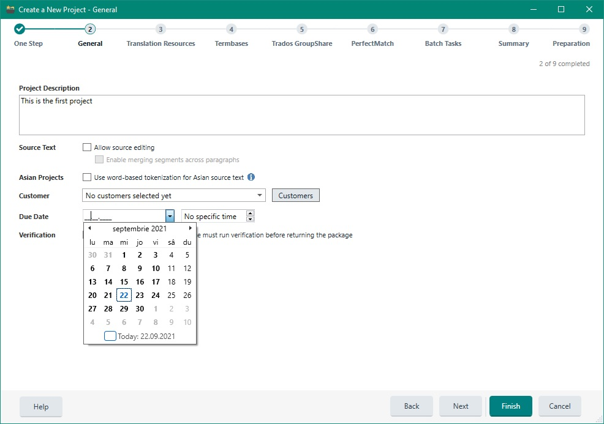

Setting the Project Information
==
In this chapter you will learn how to programmatically create a simple project, and define the general project properties such as name, description, due date, etc.

Create the Project
--
Start by implementing a function called ``` CreateProject```. Create a file-based project object called ```newProject``` based on the class [FileBasedProject](../../api\projectautomation\Sdl.ProjectAutomation.FileBased.FileBasedProject.yml). In our example we provide the project properties as parameter. We recommend that you generate the project properties through a separate helper function called e.g. GetProjectInfo as shown below:
```CS
FileBasedProject newProject = new FileBasedProject(info);
```
Set the Project Information
--
In the GetProjectInfo helper function, we first create a [ProjectInfo](../../api\projectautomation\Sdl.ProjectAutomation.Core.ProjectInfo.yml) object:
```CS
ProjectInfo info = new ProjectInfo();
``` 
We define the project properties by applying various properties to the project object as outlined below:
```CS
info.Name = "My First Project";
info.Description = "This is a programmatically created project.";
info.DueDate = DateTime.Now.AddDays(3);
```
In the above example we set the following parameters:
* Project name, which can be any descriptive name
* The (optional) project description
* The (optional) project due date, e.g. 3 days from now

The screenshot below illustrates how this information is entered in the **New Project** wizard of <Var:ProductName>.


Set the Local Project Folder
--
All project files, i.e. translatable and localizable documents, reference files, project TMs, etc. are stored in a specific folder. By default, the main folder used for storing projects is: C:\Documents and Settings\UserName\My Documents\Studio 2017\Projects. Below this main folder SDL Trados Studio 2017 creates sub-folders that carry the name of the respective project. However, you could just as well pick any other folder name, as long as the specified folder is empty so as to avoid collisions with existing files. In the example below we follow the default folder rule of <Var:ProductName> by selecting the Studio 2017\Projects\ folder below MyDocuments, and by appending the project name sub-folder. We then set the [LocalProjectFolder](../../api/projectautomation/Sdl.ProjectAutomation.Core.ProjectInfo.yml#Sdl_ProjectAutomation_Core_ProjectInfo_LocalProjectFolder) property accordingly as shown in the example below:
```CS
string localProjectFolder = Environment.GetFolderPath(Environment.SpecialFolder.MyDocuments).ToString() +
    Path.DirectorySeparatorChar + @"Studio 2011\Projects\" + info.Name;

info.LocalProjectFolder = localProjectFolder;
```
Select the Project Languages
--
A project must have at least one language pair, i.e. a source language and one target language. Projects can have only one source language, but multiple target languages. The screenshot below illustrates how languages are selected in <Var:ProductName>:


For this example, let us assume that the source language should be English (US), and the target languages German and French. First, we create the source language object through the ```Language``` class. The language object takes the [CultureInfo](https://docs.microsoft.com/en-us/dotnet/api/system.globalization.cultureinfo?redirectedfrom=MSDN&view=net-5.0) as parameter. Then we assign the source language object to the project info by applying the [SourceLanguage](../../api/projectautomation/Sdl.ProjectAutomation.Core.ProjectInfo.yml#Sdl_ProjectAutomation_Core_ProjectInfo_SourceLanguage)  property:
```CS
Language srcLang = new Language(CultureInfo.GetCultureInfo("en-US"));
info.SourceLanguage = srcLang;
```
In the next step we do the same for the target languages. Since a project can have several target languages, we use an array of language objects, and then assign this array to the project info through the [TargetLanguages](../../api/projectautomation/Sdl.ProjectAutomation.Core.ProjectInfo.yml#Sdl_ProjectAutomation_Core_ProjectInfo_TargetLanguages) property:
```CS
Language[] trgLangs = new Language[] { new Language(CultureInfo.GetCultureInfo("de-DE")), new Language(CultureInfo.GetCultureInfo("fr-FR")) };
info.TargetLanguages = trgLangs;
```
After setting the above project properties, do not forget to return the project info object:
```CS
return info;
```
Furthermore, to persist the project information in the project object, you need to apply the Save method:
```CS
newProject.Save();
```
This will create an **.sdlproj* file, which is an XML-compliant document that contains all the project information.
After running the above code you should already see a result in the projects folder as illustrated in the screenshot below:


Even if you have not added any translatable files yet, you will end up generating the project sub-folder (i.e. Projects\My first project), which contains the *.sdlproj file, and a sub-folder called File Types, which contains the file type definition (*.sdlfiletype) files for all document types that are currently supported by <Var:ProductName>. In the following chapters you will learn how to add documents, TMs, termbases, etc. to turn your sample into a meaningful project. Note that if you run your sample application again while the My first project is still there, an error will be thrown, as the folder is not empty. It is recommended that when you re-run your sample application for testing purposes that you delete the project sub-folder, so that you have a fresh start (see also [Deleting Projects](deleting_projects.md)).

Also note that the C:\Documents and Settings\Administrator\My Documents\Studio 2017\Projects folder contains a file called projects.xml. This is a meta file that contains references to all the projects that have been created in SDL Trados Studio 2017. The projects that you create programmatically will not be referenced in this file, and thus not be listed in SDL Trados Studio 2017, which is by design. However, you can, of course, open the programmatically created *.sdlproj file in SDL Trados Studio 2017.

Putting it All Together
--
The complete function for setting the project properties should look as shown below:

```CS
public ProjectInfo GetProjectInfo()
{
    #region "InfoObject"
    ProjectInfo info = new ProjectInfo();
    #endregion

    #region "GeneralInfo"
    info.Name = "My First Project";
    info.Description = "This is a programmatically created project.";
    info.DueDate = DateTime.Now.AddDays(3);
    #endregion

    #region "ProjectFolder"
    string localProjectFolder = Environment.GetFolderPath(Environment.SpecialFolder.MyDocuments).ToString() +
        Path.DirectorySeparatorChar + @"Studio 2011\Projects\" + info.Name;

    info.LocalProjectFolder = localProjectFolder;
    #endregion

    #region "SourceLanguage"
    Language srcLang = new Language(CultureInfo.GetCultureInfo("en-US"));
    info.SourceLanguage = srcLang;
    #endregion

    #region "TargetLanguages"
    Language[] trgLangs = new Language[] { new Language(CultureInfo.GetCultureInfo("de-DE")), new Language(CultureInfo.GetCultureInfo("fr-FR")) };
    info.TargetLanguages = trgLangs;
    #endregion

    #region "ReturnInfo"
    return info;
    #endregion

```
See Also
--
**Other Resources**

[Adding Files and Folders](adding_files_and_folders.md)

[Adding Translation Memories](adding_translation_memories.md)

[Running Tasks on the Project Files](running_tasks_on_project_files.md)

[Creating Projects Based on Previous Projects](creating_project_based_on_prev_proj.md)

[Creating Projects Based on Templates](creating_proj_based_on_templates.md)

[Configuring the Project Properties](configuring_the_project_properties.md)

